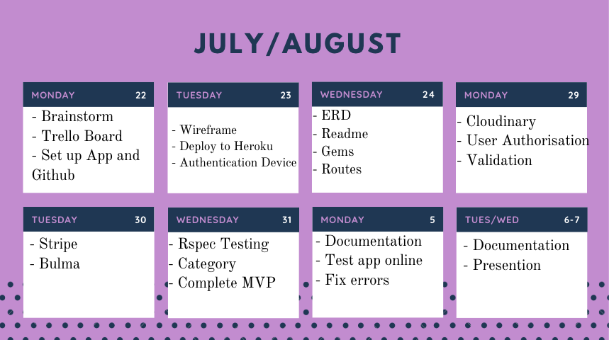
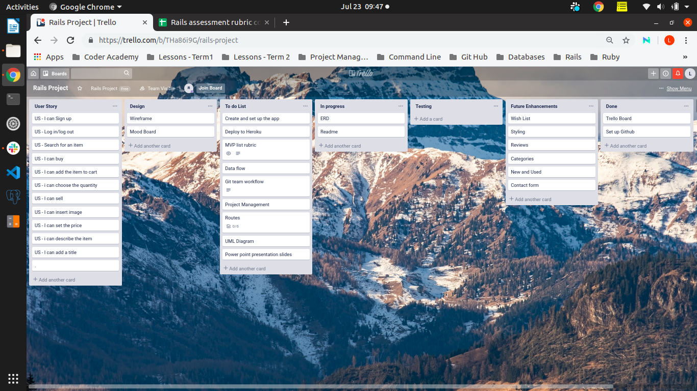
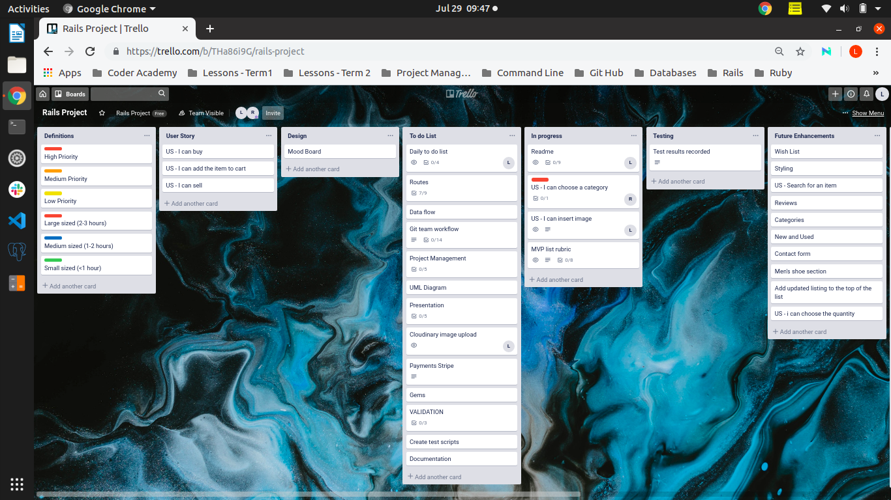
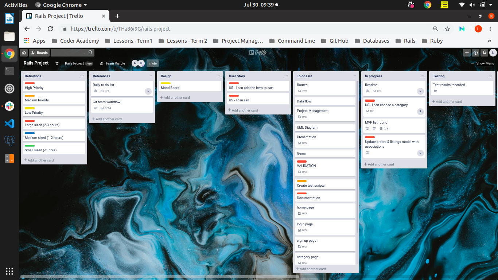
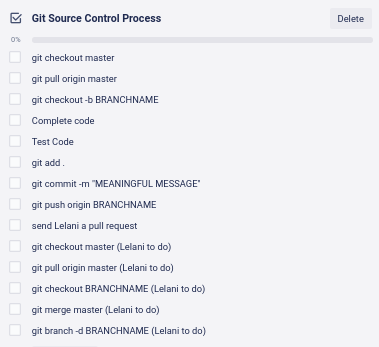

# Our Rails Project

## A link (URL) to your published App:

Here is a link to our app: https://sheltered-ridge-97373.herokuapp.com/
____________________________________________________________________________

## A link to your GitHub repository:
Here is a link to our repo: https://github.com/raeginez/railsproject
____________________________________________________________________________

## A Description of our project:


### Problem definition / purpose
The purpose of this app is to sell your used shoes. You can also buy other peoples used shoes. This can help declutter your closet space and buy shoes at discounted prices.

### Functionality / features
Our app allows a user to create an item to sell. It includes:
- A Category
- A Title
- A Description
- A Price
- An Image
- Users are also able to edit and delete their listings.

It also allows a user to purchase other users shoes. They can find shoes by one of the following categories:
- Boots
- Flats
- Trainers
- Heels

### Screenshots
Here are screenshots of our app:

This is our Home page:

<!--  -->

This is our Sell Product page:

This is our Boots Category page:

This is our Flats Category page:

This is our Trainers Category page:

This is our Heels Category page:

This is our Checkout page:

This is our Sign Up page:

This is our Login page:

This is our View Item page:

This is our Edit Item page:

This is our Delete Item page:

### Tech stack (e.g. html, css, deployment platform, etc)
Here is a list of the tech stacks we have used in our project:
- Ruby on Rails
- HTML
- CSS
- Heroku
- Bulma

Here is a list of the gems we have used in our project:
- Devise
- Stripe
- Cloudinary
- Rspec

### Instructions on how to setup, configure and use your App.
?
____________________________________________________________________________
## Our Design documentation:

## Design process
?
____________________________________________________________________________

## User stories
Here is a list of our User Stories that we created on our Trello Board:


____________________________________________________________________________

## A workflow diagram of the user journey/s.
?
____________________________________________________________________________

## Wireframes
Here are our Wireframes:


____________________________________________________________________________

## Database Entity Relationship Diagrams
Here is our ERD:


____________________________________________________________________________

## Details of planning process

## Project plan & timeline
Here is a screenshot of our project plan and timeline:


____________________________________________________________________________

## Screenshots of Trello board(s)
Here are screenshots of our Trello Board:









____________________________________________________________________________

## Answers to the Short Answer questions (Section 2.2)

### (1) What is the need (i.e. challenge) that you will be addressing in your project?

### (2) Identify the problem you’re trying to solve by building this particular marketplace App? Why is it a problem that needs solving?

### (3) Describe the project will you be conducting and how. your App will address the needs.

### (4) Describe the network infrastructure the App may be based on.

### (5) Identify and describe the software to be used in your App.

### (6) Identify the database to be used in your App and provide a justification for your choice.

### (7) Identify and describe the production database setup (i.e. postgres instance).

### (8) Describe the architecture of your App.

### (9) Explain the different high-level components (abstractions) in your App.

### (10) Detail any third party services that your App will use.

### (11) Describe (in general terms) the data structure of marketplace apps that are similar to your own (e.g. eBay, Airbnb).

### (12) Discuss the database relations to be implemented.

### (13) Describe your project’s models in terms of the relationships (active record associations) they have with each other.

### (14) Provide your database schema design.

### (15) Provide User stories for your App.
Here is a list of our User Stories that we created on our Trello Board:


____________________________________________________________________________

### (16) Provide Wireframes for your App.
Here are our Wireframes:


____________________________________________________________________________

### (17) Describe the way tasks are allocated and tracked in your project.

### (18) Discuss how Agile methodology is being implemented in your project.

### (19) Provide an overview and description of your Source control process.
Here are the steps we created and followed for using GitHub. (We added it into our Trello Board for easy reference too):


____________________________________________________________________________

### (20) Provide an overview and description of your Testing process.
We used rspec for our testing. Here is our test results report:

```

===================================
Wed 31 Jul 14:15:50 AEST 2019
===================================


ListingsController
  GET #index
    returns a success response
  GET #show
    returns a success response
  GET #new
    returns a success response
  GET #edit
    returns a success response
  POST #create
    with valid params
      creates a new Listing
      redirects to the created listing
    with invalid params
      returns a success response (i.e. to display the 'new' template)
  PUT #update
    with valid params
      updates the requested listing
      redirects to the listing
    with invalid params
      returns a success response (i.e. to display the 'edit' template)
  DELETE #destroy
    destroys the requested listing
    redirects to the listings list

CategoriesHelper
  add some examples to (or delete) /home/lelani/projects/assessment3-rails-project/railsproject/spec/helpers/categories_helper_spec.rb (PENDING: Not yet implemented)

ListingsHelper
  add some examples to (or delete) /home/lelani/projects/assessment3-rails-project/railsproject/spec/helpers/listings_helper_spec.rb (PENDING: Not yet implemented)

Category
  add some examples to (or delete) /home/lelani/projects/assessment3-rails-project/railsproject/spec/models/category_spec.rb (PENDING: Not yet implemented)

Listing
  creates new questions with correct fields

User
  creates new questions with correct fields

Categories
  GET /categories
    works! (now write some real specs)

Listings
  GET /listings
    works! (now write some real specs)

CategoriesController
  routing
    routes to #index
    routes to #new
    routes to #show
    routes to #edit
    routes to #create
    routes to #update via PUT
    routes to #update via PATCH
    routes to #destroy

ListingsController
  routing
    routes to #index
    routes to #new
    routes to #show
    routes to #edit
    routes to #create
    routes to #update via PUT
    routes to #update via PATCH
    routes to #destroy

listings/edit
  renders the edit listing form

listings/index
  renders a list of listings

listings/new
  renders new listing form

listings/show
  renders attributes in <p>

Pending: (Failures listed here are expected and do not affect your suite's status)

  1) CategoriesHelper add some examples to (or delete) /home/lelani/projects/assessment3-rails-project/railsproject/spec/helpers/categories_helper_spec.rb
     # Not yet implemented
     # ./spec/helpers/categories_helper_spec.rb:14

  2) ListingsHelper add some examples to (or delete) /home/lelani/projects/assessment3-rails-project/railsproject/spec/helpers/listings_helper_spec.rb
     # Not yet implemented
     # ./spec/helpers/listings_helper_spec.rb:14

  3) Category add some examples to (or delete) /home/lelani/projects/assessment3-rails-project/railsproject/spec/models/category_spec.rb
     # Not yet implemented
     # ./spec/models/category_spec.rb:4

Finished in 1.8 seconds (files took 3.26 seconds to load)
39 examples, 0 failures, 3 pending

```
____________________________________________________________________________
### (21) Discuss and analyse requirements related to information system security.

### (22) Discuss methods you will use to protect information and data.

### (23) Research what your legal obligations are in relation to handling user data.